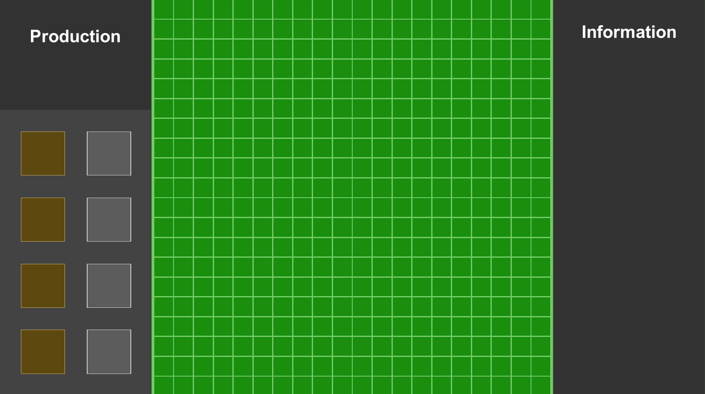

# strategy-game-demo
2D Strategy Game Using Unity3D 2018 LTS

### Description
This project about a 2d strategy game that you can build a buildings, spawn a soldier and move your soldier. Game project has followed some programming rules. 

> Rules & Features
* MVVM (Model View ViewModel), Singleton, Object Pool, Factory Patterns
* OPP (Inheritance, Polymorphism, Encaptulation, Abstraction)
* Infinite Scroll View
* A* Algorithm for path finding
* Generic game map generation

